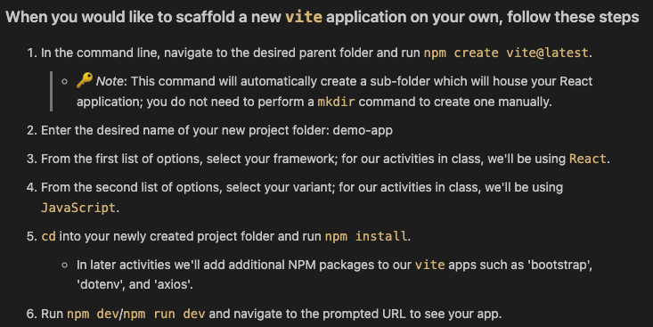
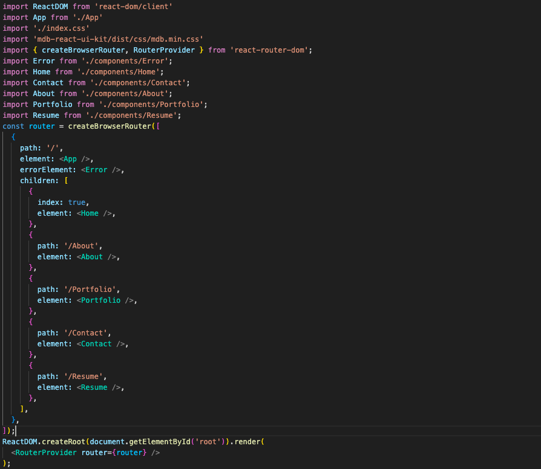
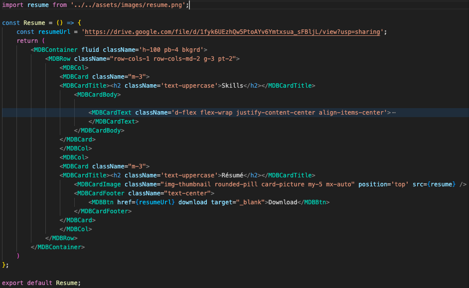
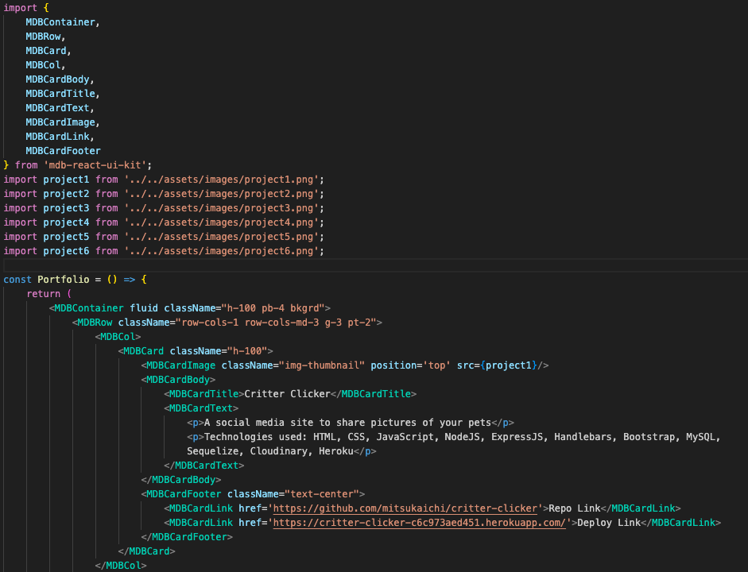
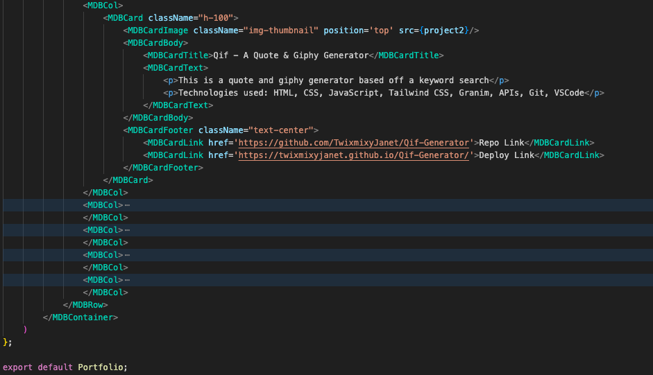

# (づ｡◕‿‿◕｡)づ JANET'S REACT PORTFOLIO ٩(｡◕‿◕｡)۶

### [View Live Project Here](https://janets-react-portfolio.netlify.app/ "JANET'S REACT PORTFOLIO")<br />

| Technology Used    | Resource URL |
| --------  | ------- |
| NodeJS | https://nodejs.org/en |
| React | https://react.dev/ |
| Vite | https://vitejs.dev/ |
| Material Design for Bootstrap | https://mdbootstrap.com/docs/standard/ |
| Font Awesome | https://www.npmjs.com/package/@fortawesome/fontawesome-free |
| ESLint  | https://www.npmjs.com/package/eslint |
| JavaScript | https://developer.mozilla.org/en-US/docs/Web/JavaScript |
| Git       | https://git-scm.com/ |
| GitHub     | https://github.com/ |
| VSCode    | https://code.visualstudio.com/ |

## Table of Contents

* [Description](#description)
* [Installation](#installation)
* [Usage](#usage)
* [License](#license)
* [About](#about)

## Description:
This project is my full stack MERN software engineer portfolio. Using Vite+React to build this application with the addition of Material Design for Bootstrap for the UI.<br />
<br />

### How to use this app:

* Be sure to have the technologies above
* Download this repository to your local device
* Run `npm i && npm run build`
* Run `npm run dev`
* Visit localhost or the live deployment above
* Navigate through the application to view portfolio information

  ## User Story

```md
AS AN employer looking for candidates with experience building single-page applications
I WANT to view a potential employee's deployed React portfolio of work samples
SO THAT I can assess whether they're a good candidate for an open position
```

## Acceptance Criteria

```md
GIVEN a single-page application portfolio for a web developer
WHEN I load the portfolio
THEN I am presented with a page containing a header, a section for content, and a footer
WHEN I view the header
THEN I am presented with the developer's name and navigation with titles corresponding to different sections of the portfolio
WHEN I view the navigation titles
THEN I am presented with the titles About Me, Portfolio, Contact, and Resume, and the title corresponding to the current section is highlighted
WHEN I click on a navigation title
THEN I am presented with the corresponding section below the navigation without the page reloading and that title is highlighted
WHEN I load the portfolio the first time
THEN the About Me title and section are selected by default
WHEN I am presented with the About Me section
THEN I see a recent photo or avatar of the developer and a short bio about them
WHEN I am presented with the Portfolio section
THEN I see titled images of six of the developer’s applications with links to both the deployed applications and the corresponding GitHub repository
WHEN I am presented with the Contact section
THEN I see a contact form with fields for a name, an email address, and a message
WHEN I move my cursor out of one of the form fields without entering text
THEN I receive a notification that this field is required
WHEN I enter text into the email address field
THEN I receive a notification if I have entered an invalid email address
WHEN I am presented with the Resume section
THEN I see a link to a downloadable resume and a list of the developer’s proficiencies
WHEN I view the footer
THEN I am presented with text or icon links to the developer’s GitHub and LinkedIn profiles, and their profile on a third platform (Stack Overflow, Twitter) 
```

### Lessons Learned 

#### 1. React & Vite
It's kind of magic! I was simply and quickly able to setup a React site by using the `npm create vite@latest` script in my terminal and answering the prompts accordingly. From there it was all about customizing the content to my portfolio needs and running `npm i` to install all of my dependencies. Below are the instructions I followed to initiate my new project.
<br />


#### 2. React Router
Continually I am working to wrap my head around routers to become a better back end developer. React helps to simplify this process. For this project I set up my routes in the main.jsx and App.jsx files. To me the React handling of routers in the DOM is much simpler than how we have previously had to set them up.
<br />


#### 3. import {images} and other things
With the introduction of using import recently we really go full-on with it in React. I utilized this to do things like import images. This way I could reference the file in JSX.
<br />


#### 4. Material Design for Bootstrap
Besides learning Vote+React, the biggest thing I learned to work with was the MDB. I used this to implement the UI throughout the site. It is used on almost every level of the application. The most robust use of it is the Portfolio page. I definitely invested a lot of time tinkering to get things to flex/flow and display how I wanted them to.
<br />



#### Synopsis
I enjoy making portfolios. To me they are very straight forward projects. Although I did find figuring out React, how to lay it out, and how to style it confounding at times it was very gratifying to see everything function in the end.

## Installation

1. Create a new repository on GitHub, to store this project.
2. Clone the repository to your computer.
3. Copy files to your own repository.
4. Follow the steps for "How to" above
5. Make changes to the code.
6. Commit the changes to the local repo.
7. Push the changes to the remote repo.

## Usage

This project is my full stack MERN software engineer portfolio. If you would like to update and use app follow the installation steps and curate it to your needs. If you would like to use this app, follow the steps under the description 'How to' above and click the link at the top of this page.

## License

MIT License
Copyright (c) 2023 Twixmixy / Janet Webster

<hr />

## About
### Janet Webster
Full Stack MERN Software Engineer

- [GitHub](https://github.com/TwixmixyJanet/)
- [LinkedIn](https://www.linkedin.com/in/twixmixy/)
- [Twitter](https://twitter.com/Twixmixy)
- [WakaTime](https://wakatime.com/@Twixmixy)


<br /><br /><br /><br /><br /><br /><br /><br /><br /><br /><br /><br /><br /><br /><br /><br /><br /><br /><br /><br /><br /><br /><br /><br /><br /><br /><br /><br /><br /><br /><br /><br /><br /><br /><br /><br /><br /><br /><br /><br /><br /><br /><br /><br /><br /><br /><br /><br /><br /><br /><br /><br /><br /><br /><br /><br /><br /><br /><br /><br /><br /><br />

Did you really read down this far? Gold star for you! ⭐
```
You have received 5+ points in being EXTRA
```